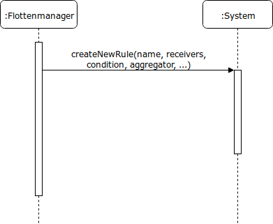
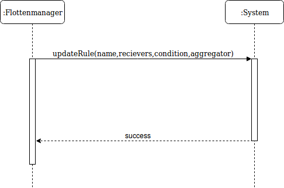
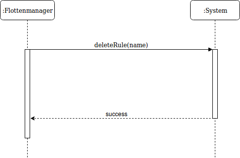
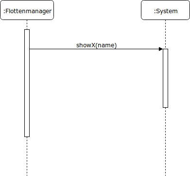
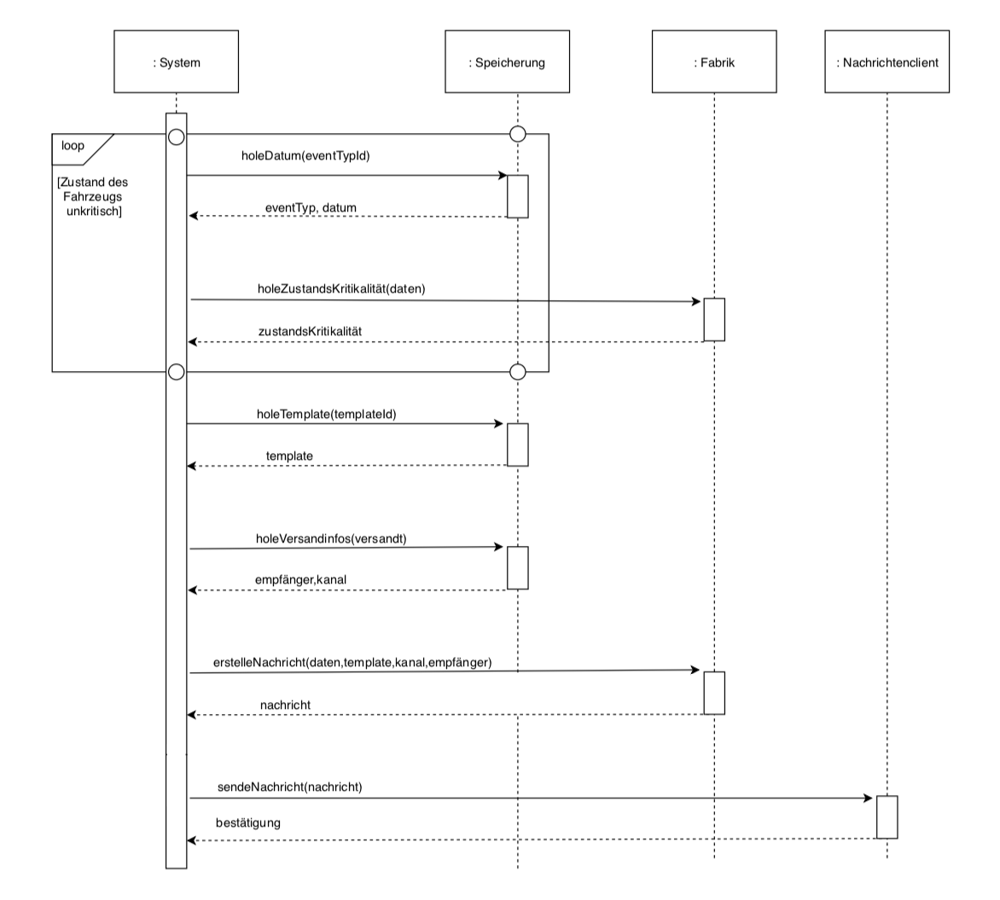
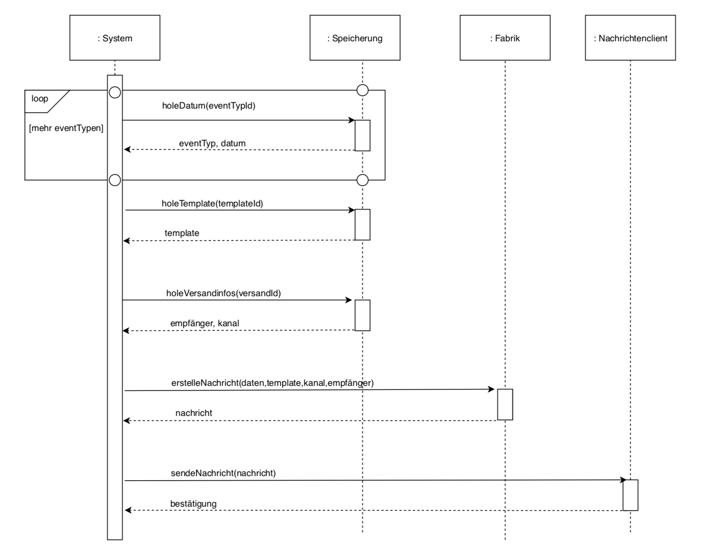

## Use-Case: Regeln für Nachrichten - Create

### Kontrakt

#### Operation

createNewRule(name, recievers, condition, aggregator)

#### Beschreibung

Eine neue Regel wird den bereits bestehenden Regeln hinzugefügt.

#### Vorbedingung

Der Flottenmanager ist am System authentifiziert.

#### Nachbedingung

Die erstellte Regel wurde dem System hinzugefügt.

#### Ausnahmen

- Die Regel ist nicht vollständig definiert.
- Die Regel besteht bereits.

#### Typ

Systemoperation

#### Querverweise

Notification-text-template

## Use-Case: Regeln für Nachrichten - Update (Verändern allg. Einstellungen analog)

### Kontrakt

#### Operation

updateRule(name, recievers, condition, aggregator)

#### Beschreibung

Eine modifizierte Regel wird in das System eingebracht.

#### Vorbedingung

Es existieren Regeln, die modifiziert werden können.

#### Nachbedingung

Die Regel wurde entsprechend der Änderungen gespreichert. Die veralteten Einstellungen wurden verworfen.

#### Ausnahme

Die modifizierte Regel existiert bereits.
Die Regel existiert nicht.

#### Typ

Systemeroperation

#### Querverweise

Notification-text-template

## Use-Case: Regeln für Nachrichten - Delete

### Kontrakt

#### Operation

deleteRule(name)

#### Beschreibung

Eine Regel wird vom Flottenmanager gelöscht.

#### Vorbedingung

Der Flottenmanager ist am System authentifiziert.

#### Nachbedingung

Die Regelmenge wurde um die gelöschten reduziert.

#### Ausnahmen

Die Regel existiert nicht und kann dementsprechend nicht gelöscht werden.

#### Typ

Systemoperation

## Use-Case: Read Regeln/allgemeine Einstellungen/Übersicht über versendete Nachrichten

### Kontrakt

#### Operation

showX(name)

#### Beschreibung

Ein Teil des System wird mit einer Lese-Operation eingesehen.

#### Vorbedingung

Der Flottenmanager ist im System authentifiziert.

#### Nachbedingung

Der Systemzustand wurde nicht verändert.

#### Ausnahme

Das Objekt, welches gelesen werden soll, existiert nicht.

#### Typ

Systemereignis

## Use-Case: Versand aggregierter Nachrichten

  
### Kontrakt

#### Operation

versand-aggregierter-nachrichten(rules, events,...)

#### Beschreibung

Das regelmäßige Versenden von Nachrichten, die von Regeln zeitgesteuert generiert werden, nachdem bis dahin neue Nachrichten aggregiert wurden.

#### Vorbedingung

Es existieren Regeln, für die nun ein neues Senden von Nachrichten geplant worden ist basierend auf dem aktuellem Zeitpunkt.

#### Nachbedingung

Die Nachrichten wurden an den Messaging Service weitergeleitet.

#### Ausnahme

Probleme mit dem externen Messaging Services und dessen Erreichbarkeit

#### Typ

Systemeroperation

#### Querverweise

zeitbasiertes Versenden von Nachrichten

## Use-Case: Versand kritischer Meldungen

  
### Kontrakt

#### Operation

processNewEvent(rules, event,...)

#### Beschreibung

Ein neues Event trifft im System ein und führt dazu, dass einige Regeln sofort Nachrichten generieren.

#### Vorbedingung

Es existieren Regeln, die es erforderlich machen, dass sofort Nachrichten versendet werden müssen, wenn ein solches Event auftritt.

#### Nachbedingung

Für alle Regeln wurden daraufhin eventuell erforderliche Nachrichten versendet.

#### Ausnahme

Probleme mit dem externen Messaging Services und dessen Erreichbarkeit

#### Typ

Systemeroperation

#### Querverweise

durch Events getriggertes Versenden von Nachrichten
