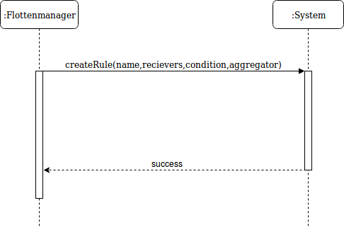

## Use-Case: Regeln für Nachrichten - Create

### Kontrakt

#### Operation

createNewRule(name, recievers, condition, aggregator, ...)

#### Beschreibung

Eine neue Regel wird den bereits bestehenden Regeln hinzugefügt.

#### Vorbedingung

Der Flottenmanager ist am System authentifiziert.

#### Nachbedingung

Eine neue Regel ist aktiv im System.

#### Ausnahmen

- Die Regel ist nicht vollständig definiert.
- Die Regel besteht bereits.

#### Typ

Systemoperation

#### Querverweise

Notification-text-template

## Use-Case: Regeln für Nachrichten - Update (Verändern allg. Einstellungen analog)

### Kontrakt

#### Operation

updateRule(name, recievers, condition, aggregator, ...)

#### Beschreibung

Eine modifizierte Regel wird in das System eingebracht.

#### Vorbedingung

Es existieren Regeln, die modifiziert werden können.

#### Nachbedingung

Die Regel ist in ihrer neuen Definition aktiv, die alte Definition ist inaktiv.

#### Ausnahme

Die modifizierte Regel existiert bereits.
Die Regel existiert nicht.

#### Typ

Systemeroperation

#### Querverweise

Notification-text-template

## Use-Case: Regeln für Nachrichten - Delete

### Kontrakt

#### Operation

deleteRule(name)

#### Beschreibung

Eine Regel wird vom Flottenmanager gelöscht.

#### Vorbedingung

Der Flottenmanager ist am System authentifiziert.

#### Nachbedingung

Die Regel kein Teil der noch existierenden Regeln.

#### Ausnahmen

Die Regel existiert nicht und kann dementsprechend nicht gelöscht werden.

#### Typ

Systemoperation

## Use-Case: Read Regeln/allgemeine Einstellungen/Übersicht über versendete Nachrichten

### Kontrakt

#### Operation

showX(name)

#### Beschreibung

Ein Teil des System wird mit einer Lese-Operation eingesehen.

#### Vorbedingung

Der Flottenmanager ist im System authentifiziert.

#### Nachbedingung

Der Systemzustand hat sich nicht verändert.

#### Ausnahme

Das Objekt, welches gelesen werden soll, existiert nicht.

#### Typ

Systemereignis